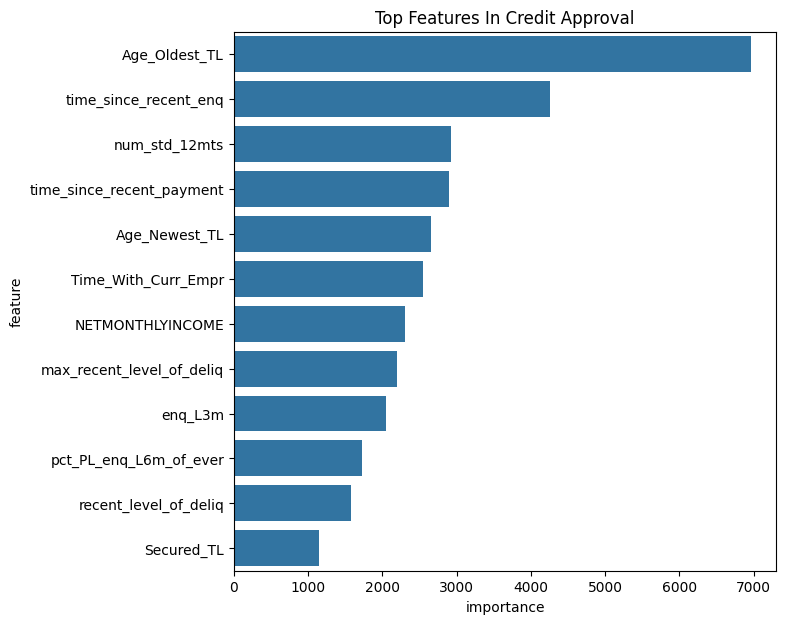
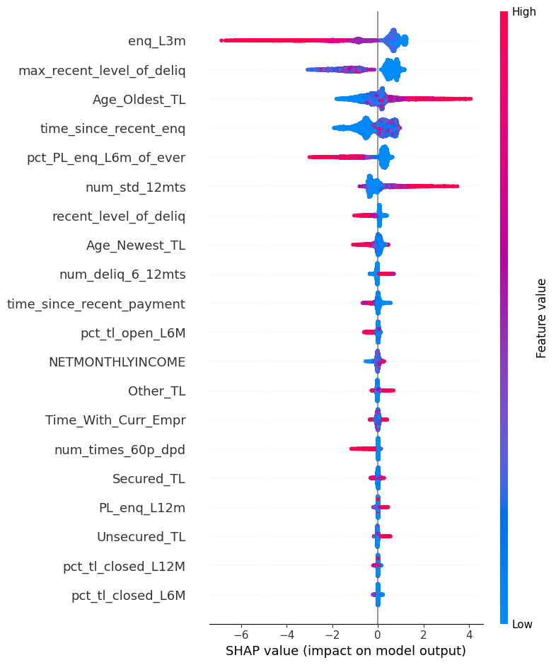

# Credit Risk Modeling & Loan Approval System

## Overview

This project builds an end-to-end **credit risk modeling system** to predict whether a loan applicant should be approved or rejected based on financial behavior, credit history, and demographic features.

The system goes beyond prediction by generating:

* Approval probability
* Credit score (300–900 scale)
* Risk segmentation (Approve / Review / Reject)

Achieved ~0.933 ROC-AUC using LightGBM on real-world credit data.

---

## Problem Statement

Banks need to assess whether a loan applicant is **creditworthy**.
This project simulates a real-world credit underwriting pipeline using machine learning.

---

## Dataset

The project uses: [Leading Indian Bank & CIBIL Real-World Dataset](https://www.kaggle.com/datasets/saurabhbadole/leading-indian-bank-and-cibil-real-world-dataset)

* Internal bank data (loan & customer attributes)
* External CIBIL-style credit data
* Unseen dataset for real-world prediction simulation

---

## Project Pipeline

Data Understanding → EDA → Feature Engineering → Modeling → Hyperparameter Tuning → Explainability → Decision System

---

## Models Used

* Logistic Regression (Baseline)
* XGBoost
* LightGBM (Best Model)
* CatBoost

---

## Model Performance

| Model               | ROC-AUC    |
| ------------------- | ---------- |
| Logistic Regression | 0.877      |
| XGBoost             | 0.931      |
| LightGBM            | **0.931+** |
| CatBoost            | 0.930      |

---

## Key Insights

* Frequent recent credit enquiries significantly reduce approval probability
* Longer credit history increases borrower trustworthiness
* Stable employment and higher income improve approval chances
* Delinquency history strongly impacts rejection decisions

---

## Key Visualizations

### Feature Importance


### SHAP Explainability


---

## Explainability (SHAP)

SHAP values were used to interpret model predictions and understand:

* Why a customer is approved or rejected
* Which features influence risk the most

---

## Decision System

The model outputs are converted into business-friendly decisions:

| Probability | Decision |
| ----------- | -------- |
| > 0.80      | Approve  |
| 0.60 – 0.80 | Review   |
| < 0.60      | Reject   |

---

## Credit Score System

Model probabilities are transformed into a **300–900 credit score**, similar to real-world systems.

| Score Range | Risk Level    |
| ----------- | ------------- |
| 750+        | Very Safe     |
| 650–750     | Safe          |
| 550–650     | Moderate Risk |
| < 550       | High Risk     |

---

## Real-World Simulation

The trained model is applied to an unseen dataset to simulate real loan decisions:

Applicant → Probability → Credit Score → Risk Band → Decision

---

## Tech Stack

* Python
* Pandas, NumPy
* Scikit-learn
* LightGBM, XGBoost, CatBoost
* Optuna (hyperparameter tuning)
* SHAP (model explainability)
* Matplotlib, Seaborn

---

## How to Run

```bash
git clone https://github.com/SayMyyName/credit-risk-modelling-loan-approval-system.git
cd credit-risk-modeling
pip install -r requirements.txt
```

---

## Conclusion

This project demonstrates a complete **end-to-end machine learning pipeline** for credit risk modeling, including preprocessing, modeling, optimization, explainability, and business decision-making.

---
